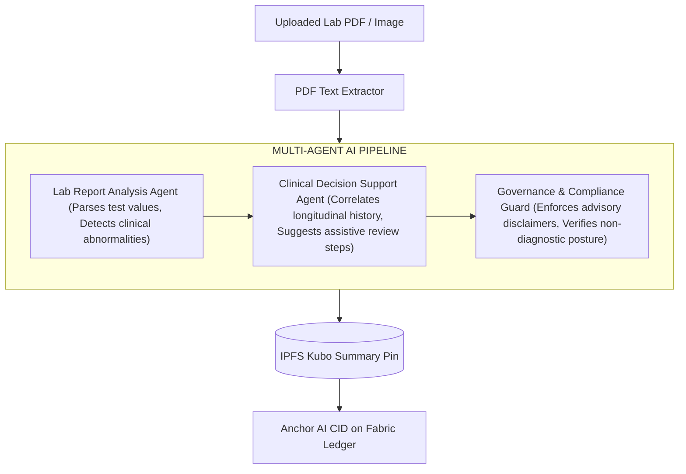

# Agentic AI & Intelligence Layer Documentation 🤖🧠

> **Gemini 2.5 Flash Autonomous Agents, PDF Report Parsing, Multi-Agent Pipeline & On-Chain Governance**

---

## 1. Autonomous Agent Roles & Workflows

The system embeds autonomous AI agents built on **Gemini 2.5 Flash** to transform unstructured medical data into structured, actionable insights while maintaining strict compliance.



### 1.1 Agent Definitions:

#### Agent 1: Lab Report Analysis Agent (`runLabReportAnalysisAgent`)
*   **Role:** Diagnostic Triage & Abnormality Detection.
*   **Tasks:** Parses raw JSON lab values and extracted PDF text. Identifies key indicators (e.g., low Hemoglobin, elevated Glucose, irregular lipid profiles).
*   **Output Structure:**
    ```json
    {
      "summary": "Low hemoglobin levels detected (8.5 g/dL); possible indication of iron-deficiency anemia.",
      "abnormalities": ["Hemoglobin 8.5 g/dL (Normal: 12.0-15.5 g/dL)"],
      "riskFlags": ["Possible Anemia Pattern"],
      "confidence": "high"
    }
    ```

#### Agent 2: Clinical Decision Support Agent (`runClinicalDecisionSupportAgent`)
*   **Role:** Longitudinal Trend & Assistive Review Recommendation.
*   **Tasks:** Queries longitudinal patient lab history from Hyperledger Fabric (`GetLabResultsByPatient`). Compares historical baselines with current findings to recommend follow-up clinical checks.
*   **Output Structure:**
    ```json
    {
      "recommendation": "Hemoglobin has dropped 3.0 g/dL compared to prior visit on 2026-02-10. Recommend retesting CBC and evaluating ferritin levels.",
      "possibleRisks": ["Acute blood loss", "Nutritional deficiency"],
      "nextSteps": ["Schedule follow-up CBC in 7 days", "Consult Hematology if trend continues"],
      "confidence": "medium"
    }
    ```

#### Agent 3: Governance & Guardrail Module
*   **Role:** Safety & Compliance Enforcement.
*   **Tasks:** Ensures AI outputs never state a definitive medical diagnosis. Attaches mandatory disclaimers and verifies prompt safety boundaries.

---

## 2. LLM Integration & Fallback Architecture

### Provider & Models
*   **Primary LLM:** `gemini-2.5-flash`
*   **Fallback Model Chain:** `gemini-2.5-flash-lite` ➔ `gemini-2.0-flash` ➔ `gemini-1.5-flash-latest` ➔ `gemini-1.5-flash`

### Model Fallback Code Logic (`ai-agent.js`):
```javascript
// Built-in automated fallback handling
if (shouldRetryAnotherModel(modelName, response.status)) {
  // Gracefully switches from Flash to Flash Lite or 2.0 Flash
  continue;
}
```

### Heuristic Fallback Engine:
If no API key is provided or external network requests fail, the gateway automatically executes an offline keyword heuristic scanner (`fallbackLabReportAnalysis`):
*   Detects `hb` / `hemoglobin` keywords ➔ flags potential anemia pattern.
*   Detects `hba1c` / `glucose` keywords ➔ flags potential glycemic abnormality pattern.
*   **Outcome:** Ensures blockchain transaction submission succeeds even during complete AI outage.

---

## 3. Privacy-Preserving Agentic Data Flow

To ensure HIPAA / GDPR compliance while utilizing public LLM APIs:
1. **PII Masking:** Direct patient identifiers (Names, Social Security Numbers, Street Addresses) are stripped before sending prompts to Gemini. Only internal pseudonymous IDs (`patientId`, `testCode`) are passed.
2. **IPFS Artifact Persistence:** Complete AI analysis outputs are saved as JSON artifacts on the local IPFS node, returning an `aiIpfs.cid`.
3. **On-Chain Anchor:** Only compact summary metadata, confidence scores, and the `aiIpfs.cid` are stored on the Hyperledger Fabric blockchain.
