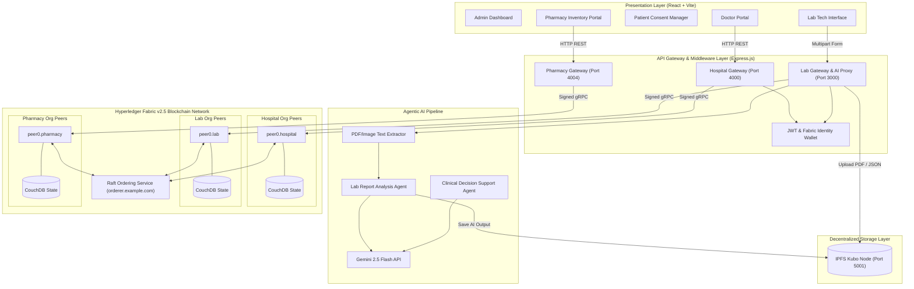
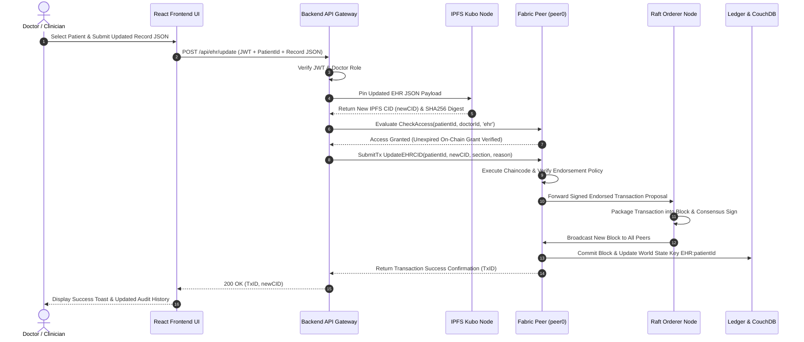
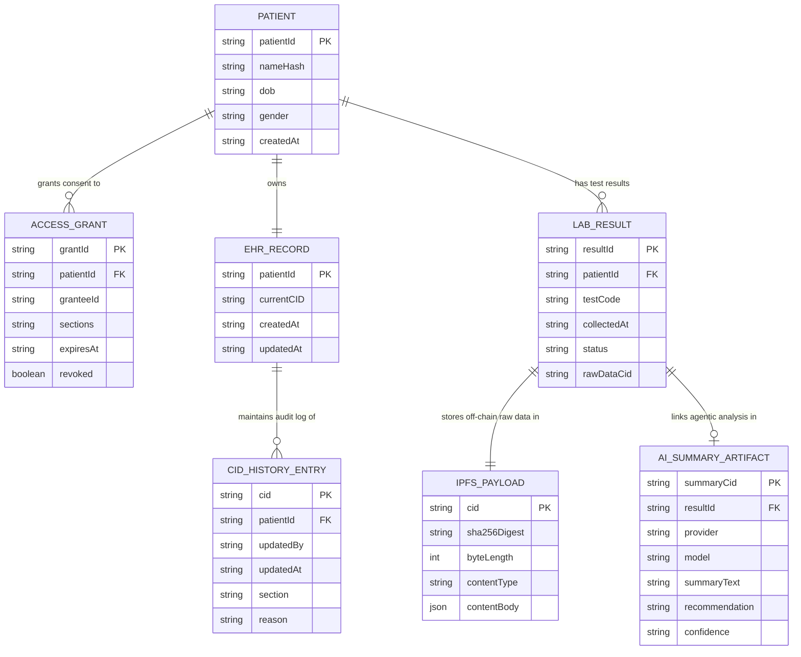

# System Architecture Diagrams 📐📊

> **Mermaid.js Visualizations for Architecture, Sequence Flow & Data Entity Relationships**

---

## 1. Complete System Architecture Diagram

---

## 2. Sequence Diagram: Doctor Updating Patient Health Record

---

## 3. Entity-Relationship Diagram (ERD): On-Chain & Off-Chain Data Entities

