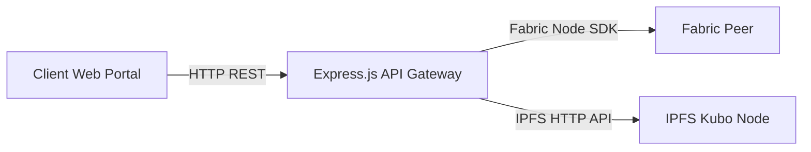

# Backend & API Gateway Documentation ⚙️🔌

> **Server Architecture, REST APIs, Fabric SDK Bridge & Off-Chain Logic**

---

## 1. API Architecture & Design

The backend serves as the secure gateway bridging client applications to the Hyperledger Fabric network and off-chain storage.



### Exposed Endpoints

#### 1. Lab & AI Gateway (`client/node-gateway/server.js` - Port `3000`)
*   `GET /api/meta` - Gateway runtime metadata, peer status, IPFS config, AI provider status.
*   `GET /api/ipfs/health` - Health check for connected IPFS Kubo daemon.
*   `POST /api/ipfs/add-json` - Pins raw JSON object to IPFS and returns CID.
*   `GET /api/ipfs/json/:cid` - Fetches and parses JSON document from IPFS CID.
*   `GET /api/records` - Queries all lab records across specified peer.
*   `GET /api/records/:resultId` - Fetches lab result by ID.
*   `GET /api/patients/:patientId/records` - Retrieves all lab records for a specific patient.
*   `POST /api/records` - Submits a lab result directly on-chain.
*   `POST /api/records/ipfs` - **Unified Endpoint:** Accepts JSON / PDF report upload, pins file to IPFS, extracts text, executes Gemini AI agents, pins AI summary to IPFS, and anchors CIDs on-chain.
*   `POST /api/ai/analyze` - Standalone endpoint to run AI agent interpretation prior to blockchain submission.
*   `GET /api/records/:resultId/resolve-data` - Fetches on-chain record and automatically resolves linked IPFS payloads.

#### 2. Hospital Org Peer Gateways (`ehr-backend-v3` - Ports `4000-4004`)
*   `POST /api/auth/login` - Authenticates hospital staff or patients, issuing JWT tokens.
*   `GET /api/ehr/:patientId` - Resolves latest EHR record and IPFS document.
*   `POST /api/ehr/:patientId` - Updates EHR sections in IPFS and updates ledger CID pointer.
*   `POST /api/access/grant` - Patient creates an access grant for a doctor.
*   `POST /api/access/revoke` - Patient revokes access grant.
*   `POST /api/visits` - Creates new clinical visit record.

---

## 2. Controllers & Business Services

1. **Fabric Gateway Service (`gateway.js` / `fabric-bridge.js`):**
   - Loads connection profile (`connection-profile.json`).
   - Retrieves user identity wallet (`User1@lab.example.com` or custom X.509 cert).
   - Establishes gRPC connection to target peer (`peer0`, `peer1`, `peer2`).
   - Distinguishes between `evaluateTransaction` (read-only queries) and `submitTransaction` (ledger state modifications requiring orderer consensus).
2. **IPFS Service (`ipfs.js`):**
   - Connects to Kubo RPC API (`http://localhost:5001`).
   - Calculates SHA-256 binary digest of uploaded files.
   - Handles multi-part buffer streams and JSON pin requests.
3. **Report Extractor Service (`report-extractor.js`):**
   - Parses incoming PDF/Image uploads.
   - Extracts plain text using `pdf-parse` or OCR to feed into AI prompts.

---

## 3. Authentication & Authorization

```text
[ User Login ] ---> Validates Credentials ---> Generates Signed JWT
                                                      |
[ Protected API Request ] <--- Bearer Token Header <--+
           |
           v
[ Gateway ] ---> Checks JWT Role ---> Maps to Fabric Wallet Certificate
                                                      |
                                                      v
                                      Submits Signed gRPC Proposal
```

*   **User Identity Management:** Users (Doctors, Patients, Admins) authenticate against an Express authentication service. Upon verification, a signed **JSON Web Token (JWT)** is issued containing `userId`, `role`, and `patientId`.
*   **Fabric Wallet Mapping:** The gateway maps the authenticated JWT user to an X.509 certificate stored in the local file wallet (`identity/wallet`).
*   **On-Chain Identity Verification:** When the transaction reaches the Fabric peer, the chaincode inspects `ctx.clientIdentity` attributes embedded in the X.509 certificate to enforce role-based rules.

---

## 4. Off-Chain Database Schemas (CouchDB & Local Caches)

### CouchDB Indexing (`HospitalOrg` & `PharmacyOrg`)
Each Fabric peer maintains a CouchDB world state. Custom JSON indexes are defined for rich querying:

```json
{
  "index": {
    "fields": ["docType", "patientId", "status"]
  },
  "name": "indexPatientStatus",
  "type": "json"
}
```

### Local User Cache Schema (SQLite / LowDB)
Used by the gateway auth service to maintain off-chain credential mappings:
*   `Users`: `{ id, username, passwordHash, role, patientId, mspId, createdAt }`
*   `Sessions`: `{ sessionId, userId, token, expiresAt }`
