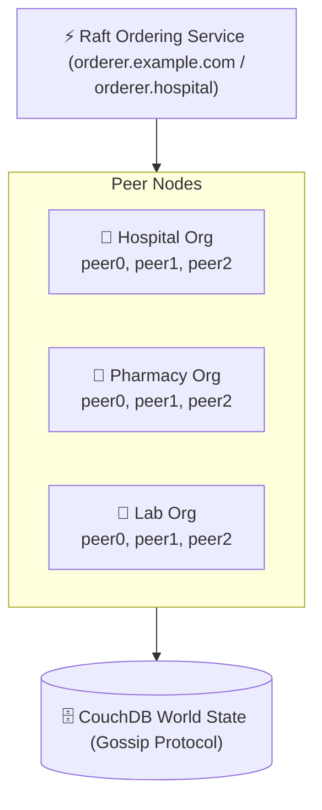
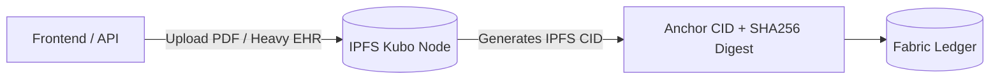

# Blockchain Layer Documentation ⛓️🔒

> **Hyperledger Fabric Smart Contracts, Chaincode Architecture, Consensus & Privacy Controls**

---

## 1. Smart Contracts & Chaincode Overview

The system incorporates Node.js smart contracts deployed on **Hyperledger Fabric v2.5**, partitioned across three primary organizations: **HospitalOrg**, **PharmacyOrg**, and **LabOrg**.

### 1.1 Hospital Organization Contracts (`ehr-chaincode-v3`)

The Hospital Org chaincode exports multiple contract classes managed via `fabric-contract-api`:

#### A. `EhrContract` (`lib/ehrContract.js`)
Manages patient EHR pointer structures, maintaining on-chain IPFS CIDs and audit trails.
*   **State Keys:** `EHR:<patientId>`
*   **State Structure:**
    ```json
    {
      "patientId": "PAT-001",
      "currentCID": "QmXoypizjW3WknFiJnKLwHCnL72vedxjQkDDP1mXWo6uco",
      "cidHistory": [
        {
          "cid": "QmXoypizjW3WknFiJnKLwHCnL72vedxjQkDDP1mXWo6uco",
          "updatedBy": "doc_smith",
          "updatedAt": "2026-08-12T22:00:00.000Z",
          "reason": "Initial allergy record creation",
          "section": "allergies"
        }
      ],
      "createdAt": "2026-08-12T22:00:00.000Z",
      "updatedAt": "2026-08-12T22:00:00.000Z"
    }
    ```
*   **Exposed Functions:**
    *   `InitEHR(ctx, patientId, initialCID)` - Instantiates a new patient EHR pointer on-chain.
    *   `UpdateEHRCID(ctx, patientId, newCID, section, reason)` - Updates current CID and appends to audit history.
    *   `GetCurrentCID(ctx, patientId)` - Fetches active IPFS CID after verifying consent.
    *   `GetEHRCIDHistory(ctx, patientId)` - Retrieves complete history of CIDs for auditability.
    *   `GetEHRBlockHistory(ctx, patientId)` - Returns immutable Fabric transaction history for key `EHR:<patientId>`.

#### B. `AccessContract` (`lib/accessContract.js`)
Handles consent management, granting or revoking third-party access to patient EHR sections.
*   **State Keys:** `ACCESS:<patientId>`
*   **Exposed Functions:**
    *   `GrantAccess(ctx, patientId, granteeId, sections, durationHours)` - Patient grants timed access to clinician.
    *   `RevokeAccess(ctx, patientId, granteeId)` - Immediately revokes access grant.
    *   `CheckAccess(ctx, patientId, granteeId, section)` - Evaluates active non-expired access.

#### C. `VisitContract`, `PatientContract`, `LabContract`, `ClaimsContract`
*   `VisitContract` (`lib/visitContract.js`): Tracks hospital visits (`PAT-001-V1`), admission records, diagnosis summaries, and attending physician IDs.
*   `PatientContract` (`lib/patientContract.js`): Registers patient identity profiles and links demographic hashes.
*   `LabContract` (`lib/labContract.js`): Tracks internal hospital lab requests (`PAT-001-V1-L1`).
*   `ClaimsContract` (`lib/claimsContract.js`): Processes health insurance claims, audit approvals, and billing status.

---

### 1.2 Pharmacy Organization Contracts (`ehr_v2.1.tar.gz`)

Focuses on pharmaceutical inventory, prescription status tracking, and supply chain stock updates.
*   **State Structures:** `PRESCRIPTION:<prescriptionId>`, `INVENTORY:<itemId>`
*   **Exposed Functions:**
    *   `CreatePrescription(ctx, prescriptionId, patientId, doctorId, medicationList)`
    *   `FulfillPrescription(ctx, prescriptionId, pharmacistId)` - Atomically deducts inventory stock level upon fulfillment.
    *   `GetInventoryByItem(ctx, itemId)` - Performs CouchDB rich queries for stock visibility.

---

### 1.3 Lab Organization Contracts (`chaincode/lab-results`)

Handles diagnostic laboratory test results and links off-chain IPFS payload CIDs and AI summaries.
*   **State Keys:** `LABRESULT:<resultId>`
*   **State Structure:**
    ```json
    {
      "resultId": "labresult1",
      "patientId": "patient-1001",
      "testCode": "CBC",
      "collectedAt": "2026-08-12T10:00:00Z",
      "status": "REPORTED",
      "resultData": {
        "storage": "ipfs",
        "cid": "QmYwAPJzv5CZsnA625s3Xf2nemtYgPpHdWEz79ojWnPbdG",
        "digest": "e3b0c44298fc1c149afbf4c8996fb92427ae41e4649b934ca495991b7852b855",
        "reportFile": {
          "cid": "QmZ4tDuvesekSs4qM5ZBKpXiZGun7S2CYtEZRB3DYXkjGx",
          "contentType": "application/pdf"
        },
        "ai": {
          "enabled": true,
          "provider": "gemini",
          "model": "gemini-2.5-flash",
          "summaryCid": "QmR9g5Z2ZpX1y4e3b0c44298fc1c149afbf4c8996fb924"
        }
      }
    }
    ```
*   **Exposed Functions:**
    *   `InitLedger(ctx)` - Seeds initial lab results.
    *   `CreateLabResult(ctx, resultId, patientId, testCode, collectedAt, status, resultData)`
    *   `ReadLabResult(ctx, resultId)`
    *   `UpdateLabStatus(ctx, resultId, newStatus)`
    *   `GetLabResultsByPatient(ctx, patientId)`

---

## 2. Consensus & Network Architecture



*   **Network Protocol:** Hyperledger Fabric v2.5 Enterprise Permissioned Blockchain.
*   **Consensus Mechanism:** **Raft (EtcdRaft)** ordering service. Guarantees crash fault tolerance (CFT), leader election, and deterministic block cut rules.
*   **Inter-Node Communication:** TLS-encrypted gRPC channels (`port 7051` for peers, `port 7050` for orderer). Multi-host setups (Pharmacy/Lab) communicate across machines via **Tailscale VPN mesh** networks.
*   **World State DB:** **CouchDB v3.3.2** running alongside each peer node, enabling JSON schema indexing and rich selector queries (`$eq`, `$regex`).

---

## 3. Data Privacy & Storage Architecture

To strictly comply with healthcare regulations (e.g., HIPAA / GDPR), raw Personally Identifiable Information (PII) and large medical scans are **never stored directly in ledger state blocks**.



1. **On-Chain Data:** Cryptographic hashes (SHA-256), IPFS CIDs, patient IDs, timestamp metadata, access control grants, and status flags.
2. **Off-Chain Data:** Unstructured PDF diagnostic reports, medical imagery, raw lab JSON envelopes, and Gemini AI analysis outputs stored in decentralized **IPFS Kubo** nodes.
3. **Data Integrity Verification:** When an API reads a record, it retrieves the CID from the blockchain, fetches the content from IPFS, and verifies the SHA-256 digest against the on-chain recorded digest.

---

## 4. Security & Access Control (ABAC)

Access control is enforced at the chaincode layer using **Attribute-Based Access Control (ABAC)** extracted from caller X.509 certificates.

```javascript
// Sample ABAC check in accessControl.js
function requireRole(ctx, ...allowedRoles) {
  const id = ctx.clientIdentity;
  const role = id.getAttributeValue('role') || '';
  if (!allowedRoles.includes(role)) {
    throw new Error(`Access denied for role '${role}'`);
  }
}
```

### Security Modifiers Implemented:
*   `requireRole(ctx, ...roles)`: Validates role attribute (`doctor`, `nurse`, `admin`, `receptionist`, `pharmacist`, `labtechnician`).
*   `assertReadAccess(ctx, patientId, section)`: Verifies that caller is either authorized staff or holds an unexpired consent grant in `ACCESS:<patientId>`.
*   `assertEHRWriteAccess(ctx, patientId)`: Restricts write operations on medical records to authorized clinicians with explicit patient consent.
