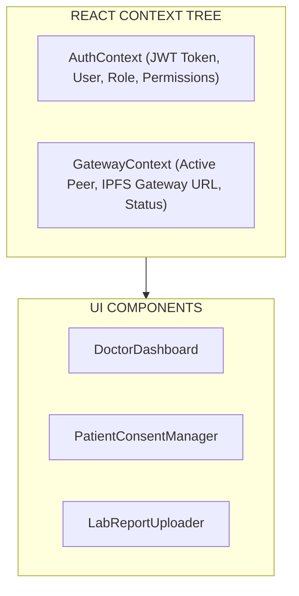

# Frontend Web Applications Documentation 💻🎨

> **UI Component Architecture, State Management, Role Dashboards & Web3 Integration**

---

## 1. Component Architecture

The frontend suite consists of modern **React 18** single-page applications bundled with **Vite** and styled using **Tailwind CSS**.

### Application Modules Structure:
```text
src/
├── components/
│   ├── common/         # Navbar, Sidebar, Modal, Alert, LoadingSpinner, Badge
│   ├── admin/          # UserManagement, NetworkHealth, AuditLogs, CertificateIssuer
│   ├── doctor/         # PatientSearch, EHRViewer, PrescriptionForm, VisitRecorder
│   ├── patient/        # AccessGrantManager, RecordHistory, MedicalTimeline, ConsentToggle
│   └── lab/            # LabResultTable, FileUploader, AiSummaryModal, PeerSelector
├── context/
│   ├── AuthContext.jsx # JWT Auth state, user session, role claims
│   └── Web3Context.jsx # Gateway endpoint selection, active peer binding
├── services/
│   ├── api.js          # Axios/Fetch client for REST gateway endpoints
│   └── ipfs.js         # IPFS gateway resolution helpers
└── views/              # Page level view containers
```

---

## 2. State Management & Web3 Integration



### Key State Management Strategies:
1. **Global Auth State (`AuthContext.jsx`):** Holds user profile, JWT token, role attributes (`doctor`, `patient`, `admin`), and active login session stored securely in `sessionStorage`.
2. **Gateway & Wallet State (`GatewayContext.jsx` / `Web3Context.jsx`):** Tracks the targeted Fabric peer (`peer0`, `peer1`, `peer2`), channel name (`ehrchannel`), and IPFS connection state.
3. **Local Component State:** Uses standard React hooks (`useState`, `useReducer`, `useEffect`) for transient form state, file upload buffers, and modal visibility.

---

## 3. Application Routes & Navigation

| Route Path | Access Scope | Purpose |
| :--- | :--- | :--- |
| `/login` | Public | Authentication page for doctors, patients, and admins. |
| `/admin/dashboard` | Admin Only | Network monitoring, peer status, identity enrollment. |
| `/doctor/patients` | Doctor Only | Search patient registry and request consent access. |
| `/doctor/ehr/:id` | Doctor Only | View/Update patient medical record sections. |
| `/patient/grants` | Patient Only | Grant or revoke doctor viewing access to medical records. |
| `/patient/records` | Patient Only | View complete personal medical timeline & IPFS reports. |
| `/lab/results` | Lab Tech | Upload lab reports (PDF/Image), trigger AI, view IPFS CIDs. |
| `/pharmacy/inventory`| Pharmacist | Fulfill prescriptions and manage pharmaceutical stock. |

---

## 4. Web3 & Blockchain Integration Path

Rather than executing gRPC directly inside browser sandboxes, the web application communicates with the blockchain via a secure REST API proxy:

```javascript
// Sample React API interaction in Lab Dashboard
async function submitLabReportWithAi(formData) {
  const response = await fetch('/api/records/ipfs', {
    method: 'POST',
    headers: {
      'x-gateway-peer': selectedPeer, // e.g. peer0.lab.example.com
    },
    body: formData, // Contains PDF file + metadata
  });
  
  const data = await response.json();
  // Returns on-chain record + IPFS CID + Gemini AI output
  return data;
}
```
