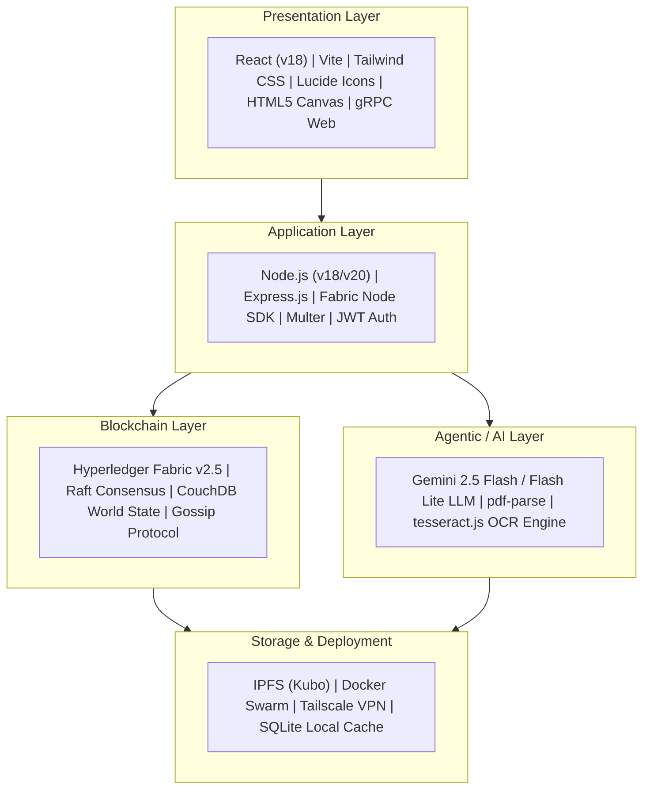

# Enterprise Blockchain Electronic Health Record (EHR) System 🏥⚡

> **Master Architecture & System Documentation**  
> *Decentralized Multi-Organization Healthcare Federation powered by Hyperledger Fabric v2.5, IPFS Kubo, Attribute-Based Access Control (ABAC), and Gemini Agentic AI.*

---

## 1. 🌟 Project Title & Vision

The **Blockchain Electronic Health Record (EHR) System** is an enterprise-grade, federated healthcare network designed to solve the critical challenges of data fragmentation, unauthorized medical record access, single points of failure, and data tampering in traditional hospital IT systems.

### Core Objectives:
1. **Multi-Organization Governance:** Connect independent healthcare stakeholders (**Hospital Org**, **Pharmacy Org**, and **Lab Org**) into a single, unified Hyperledger Fabric blockchain network with raft consensus and gossip protocol state distribution.
2. **Attribute-Based Access Control (ABAC) & Patient Sovereignty:** Enforce strict consent management where patients cryptographically own their data. Clinicians (Doctors/Nurses) cannot view patient records without explicit, time-bounded on-chain consent grants.
3. **Dual On-Chain / Off-Chain Architecture:** Store lightweight cryptographic hashes, CIDs, and metadata on the ledger while storing heavy clinical documents, PDF diagnostic reports, and raw JSON payloads on a decentralized **IPFS (Kubo)** storage network.
4. **Atomic Supply Chain Deductions:** Implicitly deduct global hospital pharmaceutical stock when prescriptions are fulfilled by pharmacists.
5. **Agentic Clinical Decision Support:** Integrate LLM-powered autonomous agents (Gemini 2.5 Flash) to parse unstructured PDF/image lab reports, detect clinical abnormalities, correlate findings with longitudinal patient history, and anchor AI compliance metadata on-chain.

---

## 2. 📊 Current State of the Project (Brutally Honest Assessment)

| Feature / Subsystem | Implementation Status | Maturity Level | Gaps / Missing Capabilities |
| :--- | :--- | :--- | :--- |
| **Hyperledger Fabric Network (Hospital Org)** |  Fully Implemented | **Production Ready** | Fabric CA setup complete; scripts automate 3-peer topology. |
| **Docker Swarm Multi-Host (Pharmacy Org)** |  Fully Implemented | **Production Ready** | Orchestrated across physical nodes (`PC1`, `PC2`, `PC3`) via Tailscale VPN mesh. |
| **Multi-Host Network (Lab Org)** |  Fully Implemented | **Staging Ready** | Operates across macOS (Colima) and Ubuntu with peer redundancy. |
| **Smart Contracts / Chaincode (Hospital)** |  Fully Implemented | **Production Ready** | 9 contracts (`ehr`, `access`, `visit`, `patient`, `lab`, `claims`, etc.) with ABAC. |
| **Smart Contracts / Chaincode (Pharmacy)** |  Fully Implemented | **Production Ready** | Rich queries for CouchDB, inventory deduction, and prescription status transitions. |
| **Smart Contracts / Chaincode (Lab)** |  Fully Implemented | **Production Ready** | Lab result CRUD, status updates (`ORDERED`, `IN_PROGRESS`, `REPORTED`), CID anchoring. |
| **IPFS Off-Chain Storage Integration** |  Fully Implemented | **Production Ready** | Kubo IPFS nodes integrated; handles binary PDF reports, JSON envelopes, and CID resolution. |
| **Agentic AI & LLM Engine** |  Fully Implemented | **Production Ready** | Gemini 2.5 Flash integration with fallback heuristic engine, PDF text extraction, and prompt safety. |
| **Frontend Web Portals (Hospital)** | 🟡 Partially Implemented | **Prototype / Demo** | React + Vite UI exists for Admin/Doctor/Patient, but Web3/Fabric wallet binding relies on REST proxy. |
| **Frontend Web Portals (Pharmacy)** |  Fully Implemented | **Staging Ready** | 4 separate dashboards (`manager`, `patient`, `employee`, `inventory`) built in Vite React. |
| **Frontend Web Portals (Lab)** |  Fully Implemented | **Staging Ready** | Browser UI embedded inside Express gateway for peer selection and IPFS/AI resolution. |
| **Production Key & Identity Management** | 🟡 Partially Implemented | **Development** | Uses pre-generated `cryptogen` materials and static test admin identities alongside Fabric CA scripts. |

---

## 3. 🛠️ Overall Technology Stack



---

## 4. 📐 System Architecture Summary

The architecture follows a 4-tier decentralized model:
1. **Client / Presentation Tier:** Role-specific web applications communicate with backend API gateways over HTTPS REST/JSON endpoints.
2. **API Gateway / Middleware Tier:** Node.js Express servers utilize the Hyperledger Fabric Node SDK to convert incoming HTTP requests into signed gRPC transaction proposals. Gateways handle JWT validation, local credential wallet lookup, file extraction, and IPFS upload orchestrations.
3. **Off-Chain Storage & Agentic AI Pipeline:** 
   - Unstructured clinical files (PDFs/Images) uploaded via API are pinned directly to an **IPFS Kubo** node.
   - Text extracted from reports is fed into dual **Gemini LLM agents** (`LabReportAnalysisAgent` and `ClinicalDecisionSupportAgent`).
   - The generated AI summary artifact is stored in IPFS, returning an AI summary CID.
4. **Blockchain Consensus & Ledger Tier:** 
   - The API Gateway executes transactions on Hyperledger Fabric.
   - Smart contracts evaluate Attribute-Based Access Control (ABAC) attributes embedded in client X.509 certificates.
   - On approval, the immutable ledger records transaction history while CouchDB maintains state index for fast rich querying.

---

## 5. 🗂️ Comprehensive Folder Structure

Below is the directory map of the entire workspace across all student/organization submissions:

```text
EHR_blockchain/
├── 25CSM2R05_Avijit_Ram_EHR_final-20260530T051550Z-3-001/
│   └── 25CSM2R05_Avijit_Ram_EHR_final/
│       ├── 25CSM2R05_codes.zip
│       ├── EHR_System_Presentation.pptx.pdf
│       └── README.md.pdf
├── 25CSM2R16_Rahul-20260530T051725Z-3-001/
│   └── 25CSM2R16_Rahul/
│       ├── EHR_SourceCode.zip
│       └── Project_Requirements.pdf
├── 25CSMR03-20260812T214152Z-1-001/
│   └── 25CSMR03/                  # PHARMACY ORGANIZATION MODULE
│       ├── 25csm2r03_25csm2r13_25csm2s06_project.zip
│       ├── README.md              # Fabric Swarm Network Documentation
│       └── SUPPLEMENTARY.md       # Multi-Node Infrastructure Manual
├── 25CSMR10-20260812T214155Z-1-001/
│   └── 25CSMR10/                  # HOSPITAL ORGANIZATION MODULE
│       ├── EHR_hospitalOrg-main.zip
│       └── EHR_System_Presentation.pptx.pdf
├── 25CSMR15-20260812T214810Z-1-001/
│   └── 25CSMR15/                  # LAB ORGANIZATION MODULE
│       ├── EHR-LABORG-main.zip
│       └── README.md              # Multi-Host Fabric & Agentic AI Manual
└── extracted/                      # UNPACKED CODEBASES
    ├── HospitalOrg/EHR_hospitalOrg-main/
    │   ├── ehr-backend-v3/        # Express API Gateways (Peer0, Peer1, Peer2, Patient API)
    │   ├── ehr-chaincode-v3/      # Fabric Contracts (ehr, access, visit, lab, claims)
    │   ├── ehr-frontend-v2/       # React + Vite Multi-Role Web Application
    │   └── ehr-network/           # Fabric v2.5 Network Topology Scripts & Crypto Config
    ├── PharmacyOrg/fabric-network-swarm/
    │   ├── app/                   # Dashboards: billing, employee, inventory, manager, patient
    │   ├── compose/               # Docker Swarm Compose files for PC1, PC2, PC3
    │   └── ehr_v2.1.tar.gz        # Pharmacy & Prescription Chaincode Package
    └── LabOrg/EHR-LABORG-main/
        ├── chaincode/lab-results/ # Lab Results Smart Contract
        ├── client/node-gateway/   # Express API Gateway, IPFS client & Gemini AI Agents
        ├── docker/                # Multi-host Compose stacks for Machine 1, 2, 3
        └── scripts/               # Multi-host Fabric deployment and verification scripts
```

---

## 6. 🚀 Getting Started / Developer Setup Guide

### Prerequisites

> [!IMPORTANT]
> Ensure you have the correct versions of Node.js and Docker before proceeding.

- **OS:** Ubuntu 22.04 LTS (recommended) or macOS with Docker Desktop / Colima
- **Tools:** Docker v24.0+, Docker Compose v2.20+, Node.js v18.x LTS, Git, cURL, jq
- **Fabric Binaries:** Hyperledger Fabric v2.5.x binaries (`peer`, `configtxgen`, `cryptogen`)

### Quickstart Step 1: Spin Up the Lab & Hospital Blockchain Stack
```bash
# Navigate to the Lab Organization directory
cd extracted/LabOrg/EHR-LABORG-main

# Step 1.1: Download Fabric binaries and generate crypto material
chmod +x scripts/*.sh
./scripts/download-fabric.sh
./scripts/generate-artifacts.sh

# Step 1.2: Launch Machine 1 Containers (Orderer + Peer0 + CouchDB + IPFS Kubo + Explorer)
./scripts/start-machine1.sh

# Step 1.3: Create channel and join Peer0
./scripts/create-channel.sh

# Step 1.4: Deploy Lab Results Smart Contract
./scripts/deploy-labresults-machine1.sh
```

### Quickstart Step 2: Configure Environment & AI Credentials
Create or update `extracted/LabOrg/EHR-LABORG-main/client/node-gateway/.env`:
```env
PORT=3000
GATEWAY_BIND_HOST=0.0.0.0
GATEWAY_PEER=peer0.lab.example.com
IPFS_API_URL=http://localhost:5001
IPFS_GATEWAY_URL=http://localhost:8080
GEMINI_MODEL=gemini-2.5-flash
GEMINI_API_KEY=YOUR_GEMINI_API_KEY_HERE
```

### Quickstart Step 3: Launch Gateway API & Web Dashboard
```bash
cd extracted/LabOrg/EHR-LABORG-main/client/node-gateway
npm install
npm run web
```
The application dashboard will be live at `http://localhost:3000`.

### Quickstart Step 4: Launch Hospital Org Application
```bash
# In a new terminal, launch the Hospital Backend API
cd extracted/HospitalOrg/EHR_hospitalOrg-main/ehr-backend-v3/peer0-api
npm install
npm start

# In another terminal, launch the Hospital Frontend UI
cd extracted/HospitalOrg/EHR_hospitalOrg-main/ehr-frontend-v2
npm install
npm run dev
```
The Hospital UI will be accessible at `http://localhost:5173`.
