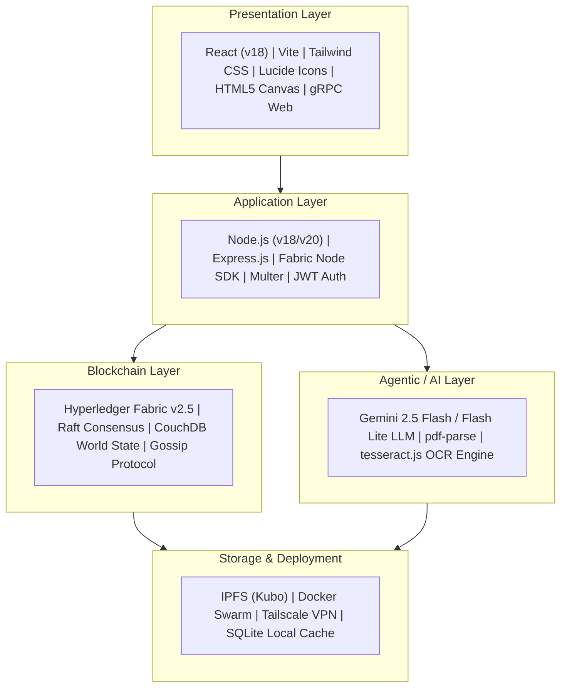
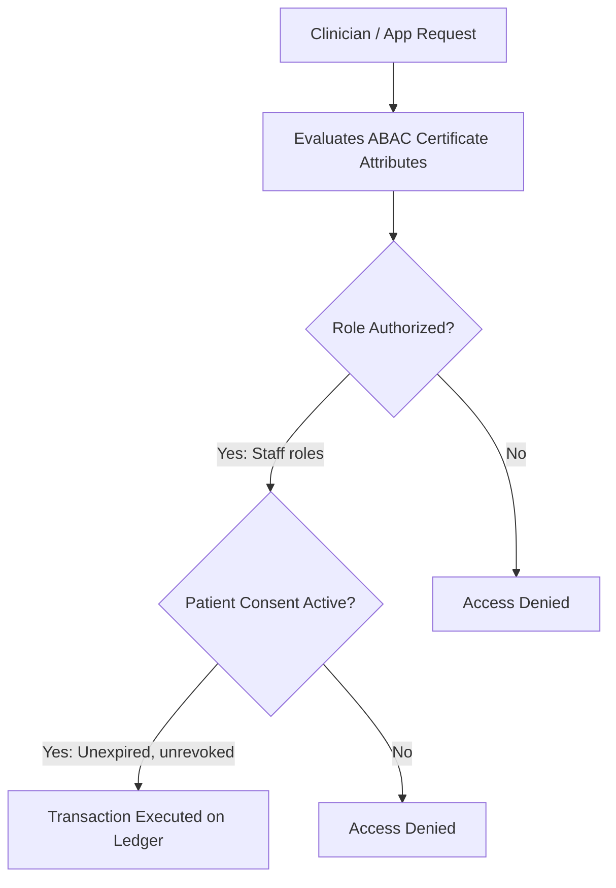

# Federated Blockchain Electronic Health Record (EHR) System 🏥⚡

> **Complete Master Documentation & Directory Blueprint**  
> *A Privacy-Preserving, Multi-Organization Healthcare Ecosystem built on Hyperledger Fabric v2.5, IPFS Kubo, Attribute-Based Access Control (ABAC), Docker Swarm, and Gemini 2.5 Flash Agentic AI.*

---

## 📋 Executive Summary & System Vision

The **Federated Blockchain Electronic Health Record (EHR) System** is a multi-tenant enterprise healthcare platform. It bridges three independent healthcare organizations—**Hospital Organization**, **Pharmacy Organization**, and **Laboratory Organization**—into a permissioned, decentralized blockchain network.

### Primary Architectural Pillars:
1. **Patient Sovereignty & ABAC Consent:** Medical records belong to patients. Clinicians cannot access sensitive EHR data without an explicit, time-bounded on-chain consent grant verified by Attribute-Based Access Control (ABAC) embedded in X.509 certificates.
2. **Dual On-Chain / Off-Chain Storage:** Heavy clinical data (PDF lab reports, imaging, full medical histories) are stored off-chain on a decentralized **IPFS (Kubo)** network. Only lightweight cryptographic hashes (SHA-256), IPFS CIDs, metadata, and status flags are committed to the Hyperledger Fabric blockchain.
3. **Atomic Pharmacy Supply Chain:** Fulfilling patient prescriptions automatically triggers atomic deductions from the global hospital pharmaceutical stock.
4. **Agentic Clinical AI Integration:** LLM autonomous agents powered by **Gemini 2.5 Flash** extract text from unstructured PDF/image lab reports, detect clinical abnormalities, correlate current results with longitudinal patient history from the ledger, and anchor compliance summary artifacts on-chain.

---

## 📊 Module Maturity & Implementation Matrix

| Module / System | Core Technologies | Current Status | Key Features Implemented |
| :--- | :--- | :--- | :--- |
| **Hospital Org Core** | Hyperledger Fabric v2.5, Express.js, React 18, Vite | **Production Ready** | 9 Node.js smart contracts (`ehr`, `access`, `visit`, `patient`, `lab`, `claims`), ABAC modifiers, microservice backend (`peer0` to `peer2`), multi-role React frontend. |
| **Pharmacy Org Swarm** | Fabric v2.5, Docker Swarm, Tailscale VPN, Vite React | **Production Ready** | Multi-node Docker Swarm orchestration across physical PCs (`PC1`, `PC2`, `PC3`), inventory chaincode, 4 web portals (`manager`, `patient`, `employee`, `inventory`). |
| **Lab Org & Agentic AI** | Fabric v2.5, IPFS Kubo v0.26+, Gemini 2.5 Flash, Express | **Production Ready** | Multi-host network across macOS & Ubuntu, `labresults` chaincode, IPFS binary/JSON pinning, dual Gemini LLM agents, PDF OCR extractor, browser dashboard. |

---

## 🛠️ Complete Technology Stack



---

## 🗂️ Complete Directory & File Blueprint ("What Has What")

Below is the complete, detailed file tree of the workspace with explanations of what each folder and key file contains:

```text
c:\Users\himan\Desktop\EHR_blockchain\
│
├── README.md                              # Master System Documentation (This file)
├── MAIN_README.md                         # Architecture Overview & Setup Guide
├── BLOCKCHAIN_README.md                   # Chaincode, Smart Contracts & Consensus Details
├── BACKEND_README.md                      # API Gateways, Express Services & Fabric SDK Bridge
├── FRONTEND_README.md                     # React / Vite Web Portals & State Management
├── AGENTIC_README.md                      # Gemini 2.5 Flash AI Autonomous Agents Pipeline
├── IMPLEMENTATION_ROADMAP_README.md       # Gap Analysis, Technical Backlog & Roadmap
├── ARCHITECTURE_DIAGRAMS.md               # Mermaid.js Visual Diagrams (System, Sequence, ERD)
│
├── extracted/                             # UNPACKED CODEBASES (Ready for Development)
│   │
│   ├── HospitalOrg/                       # 🏥 HOSPITAL ORGANIZATION CODEBASE
│   │   └── EHR_hospitalOrg-main/
│   │       ├── ehr-chaincode-v3/          # Node.js Smart Contracts (Fabric Contract API)
│   │       │   ├── lib/
│   │       │   │   ├── accessControl.js   # ABAC role checks (doctor, nurse, patient) & consent verifier
│   │       │   │   ├── ehrContract.js     # Patient EHR state, currentCID pointer, & audit history
│   │       │   │   ├── accessContract.js  # GrantAccess & RevokeAccess consent logic
│   │       │   │   ├── visitContract.js   # Clinical visit tracking (PAT-001-V1)
│   │       │   │   ├── patientContract.js # Patient demographic profiles & registration
│   │       │   │   ├── labContract.js     # Hospital internal lab requests
│   │       │   │   └── claimsContract.js  # Medical insurance claims & approval workflow
│   │       │   └── index.js               # Contract entrypoint exporting all classes
│   │       │
│   │       ├── ehr-backend-v3/            # Node.js / Express API Gateways
│   │       │   ├── peer0-api/             # Express server connecting to Fabric Peer 0 (Port 4000)
│   │       │   ├── peer1-api/             # Express server connecting to Fabric Peer 1 (Port 4001)
│   │       │   ├── peer2-api/             # Express server connecting to Fabric Peer 2 (Port 4002)
│   │       │   ├── patient-api/           # Dedicated API gateway for authenticated patients (Port 4003)
│   │       │   ├── extorg-api/            # Gateway for external third-party entities (Port 4004)
│   │       │   └── ipfs-service/          # Microservice wrapping IPFS Kubo node operations
│   │       │
│   │       ├── ehr-frontend-v2/           # React 18 + Vite Web Application
│   │       │   ├── src/
│   │       │   │   ├── components/        # Admin, Doctor, Patient & Common UI components
│   │       │   │   ├── context/           # AuthContext (JWT) & Web3Context
│   │       │   │   └── views/             # Page views for Login, Dashboard, Consent Manager
│   │       │   └── package.json           # Frontend dependencies (React, Vite, Tailwind)
│   │       │
│   │       └── ehr-network/               # Fabric Network Deployment & Crypto Config
│   │           ├── crypto-config.yaml     # Organization MSP certificate structure
│   │           ├── configtx.yaml          # Fabric Channel & Orderer genesis block profiles
│   │           └── docker-compose.yaml    # Containers for Orderer, Peers, & CouchDB
│   │
│   ├── PharmacyOrg/                       # 💊 PHARMACY ORGANIZATION CODEBASE
│   │   └── fabric-network-swarm/
│   │       ├── app/                       # 4 Specialized Web Applications (Vite + React)
│   │       │   ├── manager/               # Hospital Governance & Manager Dashboard
│   │       │   ├── patient/               # Patient Portal for prescription history
│   │       │   ├── employee/              # Pharmacist Fulfillment Portal
│   │       │   ├── billing/               # Patient billing & payment checkout portal
│   │       │   └── inventory/             # Global Hospital Pharmaceutical Stock Management
│   │       │
│   │       ├── compose/                   # Multi-Host Docker Swarm Compose Configurations
│   │       │   ├── docker-compose-pc1.yaml # Orchestration for Swarm Manager (PC1)
│   │       │   ├── docker-compose-pc2.yaml # Worker Node 2 setup (PC2)
│   │       │   └── docker-compose-pc3.yaml # Worker Node 3 setup (PC3)
│   │       │
│   │       ├── ehr_v2.1.tar.gz            # Compiled Pharmacy Smart Contract Package
│   │       ├── deploy.sh                  # Automated multi-node deployment & teardown script
│   │       └── SUPPLEMENTARY.md           # Network topology & Tailscale VPN guide
│   │
│   ├── LabOrg/                            # 🧪 LABORATORY ORGANIZATION & AI CODEBASE
│   │   └── EHR-LABORG-main/
│   │       ├── chaincode/lab-results/     # Lab Results Smart Contract
│   │       │   └── lib/lab-results.js     # CRUD for test codes (CBC, LIPID, HbA1c) & CID links
│   │       │
│   │       ├── client/node-gateway/       # Express API Gateway & Agentic AI Engine
│   │       │   ├── server.js              # REST endpoints (`/api/records/ipfs`, `/api/ai/analyze`)
│   │       │   ├── ai-agent.js            # Gemini 2.5 Flash agents + Fallback Heuristic engine
│   │       │   ├── report-extractor.js    # PDF & Image text extraction service
│   │       │   ├── ipfs.js                # IPFS Kubo RPC API client
│   │       │   ├── gateway.js             # Fabric Node SDK connection manager
│   │       │   └── public/                # Embedded operational Lab Browser Dashboard
│   │       │
│   │       ├── docker/                    # Multi-Host Docker Stacks
│   │       │   ├── docker-compose.machine1.yaml # Orderer + Peer0 + CouchDB + IPFS Kubo + Explorer
│   │       │   ├── docker-compose.machine2.yaml # Peer1 + CouchDB
│   │       │   └── docker-compose.machine3.yaml # Peer2 + CouchDB
│   │       │
│   │       └── scripts/                   # Shell scripts for network bootstrap & verification
│   │           ├── generate-artifacts.sh  # Generates crypto-config and channel blocks
│   │           ├── start-machine1.sh      # Launches Machine 1 containers
│   │           ├── create-channel.sh       # Creates `ehrchannel` and joins Peer0
│   │           └── deploy-labresults-machine1.sh # Deploys lab chaincode
│   │
│   └── Avijit_Ram/                        # Direct extracted submission copy of 25CSM2R05_codes.zip
│       └── 25CSM2R05_codes/               # Base implementation of Hospital Org
│
└── ZIP Archives & Student Submission Folders (Original Source Files)
    ├── 25CSM2R05_Avijit_Ram_EHR_final-20260530T051550Z-3-001/
    ├── 25CSM2R16_Rahul-20260530T051725Z-3-001/
    ├── 25CSMR03-20260812T214152Z-1-001/    # Pharmacy Org Zip Archive & Manuals
    ├── 25CSMR10-20260812T214155Z-1-001/    # Hospital Org Zip Archive & Presentations
    └── 25CSMR15-20260812T214810Z-1-001/    # Lab Org Zip Archive & Video Demos
```

---

## 🔍 Module Details: What Each Component Does

### 1. Hospital Organization Module (`extracted/HospitalOrg`)
* **Purpose:** Serves as the primary medical administration node. Maintains electronic health record pointers, patient demographic registrations, physician visits, and access permissions.
* **Chaincode (`ehr-chaincode-v3`):** 
  * `ehrContract.js`: Maintains the active IPFS CID (`currentCID`) pointing to the patient's off-chain clinical file, as well as an immutable audit trail (`cidHistory`) of all previous modifications.
  * `accessContract.js`: Controls access consent grants (`ACCESS:<patientId>`). Patients can grant access to doctors for specific sections (e.g. `allergies`, `surgicalHistory`) for a defined duration in hours.
* **Backend API (`ehr-backend-v3`):** Exposes REST endpoints on ports `4000-4004`. Maps authenticated JWT requests to local Fabric user identity certificates before invoking smart contracts via gRPC.

### 2. Pharmacy Organization Module (`extracted/PharmacyOrg`)
* **Purpose:** Manages pharmaceutical inventory across hospital wards and fulfills patient prescriptions.
* **Network Setup:** Runs a multi-node **Docker Swarm** cluster across 3 physical machines (`PC1`, `PC2`, `PC3`) connected via Tailscale VPN mesh.
* **Chaincode (`ehr_v2.1.tar.gz`):** Uses CouchDB rich index queries to locate prescriptions and inventory items. Fulfilling a prescription automatically executes an atomic reduction of inventory stock.
* **Frontends (`app/`):** Contains 4 distinct React web dashboards tailored for Managers, Patients, Pharmacists, and Billing Officers.

### 3. Laboratory Organization & AI Module (`extracted/LabOrg`)
* **Purpose:** Handles diagnostic lab test requests (CBC, LIPID, HbA1c), off-chain storage of heavy PDF reports, and LLM-powered assistive diagnostics.
* **IPFS Kubo Integration (`ipfs.js`):** Uploaded PDF lab reports and JSON payloads are pinned directly to an IPFS Kubo node (`http://localhost:5001`). The resulting IPFS CID and SHA-256 digest are anchored on the blockchain.
* **Agentic AI Pipeline (`ai-agent.js`):**
  * **`LabReportAnalysisAgent`**: Parses test values and PDF text using Gemini 2.5 Flash to detect abnormalities and flag potential health risks.
  * **`ClinicalDecisionSupportAgent`**: Queries prior lab results from the Fabric ledger to compare longitudinal trends and suggest assistive next review steps.
  * **Fallback Heuristic Engine**: Runs regex/keyword analysis if Gemini API keys are unconfigured, ensuring ledger submissions never fail.

---

## 🔐 Privacy, Security & Access Control Architecture



1. **Attribute-Based Access Control (ABAC):** Attributes (e.g. `role=doctor`, `patientId=PAT-001`) are cryptographically embedded into client X.509 certificates during enrollment by the Fabric CA.
2. **Consent Grants:** Doctors and Nurses cannot read or write to a patient's `ehr` section unless an active, unexpired grant exists in `ACCESS:<patientId>`.
3. **Data Integrity:** Off-Chain IPFS content is validated by comparing the SHA-256 digest calculated at download against the immutable SHA-256 digest recorded in the blockchain state.

---

## 🚀 Step-by-Step Developer Setup & Execution Guide

### Prerequisites

> [!IMPORTANT]
> Ensure you have the correct versions of Node.js and Docker before proceeding.

- **Operating System:** Ubuntu 22.04 LTS (Recommended) or macOS with Docker / Colima
- **Dependencies:** Docker v24.0+, Docker Compose v2.20+, Node.js v18.x LTS, Git, cURL, jq
- **Fabric Binaries:** Hyperledger Fabric v2.5.x

---

### Step 1: Initialize the Lab Organization Network
```bash
# 1. Navigate to the Lab Org workspace
cd extracted/LabOrg/EHR-LABORG-main

# 2. Make scripts executable and download Fabric binaries
chmod +x scripts/*.sh
./scripts/download-fabric.sh

# 3. Generate crypto material and channel artifacts
./scripts/generate-artifacts.sh

# 4. Launch Machine 1 containers (Orderer + Peer0 + CouchDB + IPFS Kubo + Explorer)
./scripts/start-machine1.sh

# 5. Create `ehrchannel` and join Peer0
./scripts/create-channel.sh

# 6. Deploy Lab Results Smart Contract
./scripts/deploy-labresults-machine1.sh
```

---

### Step 2: Configure Environment & AI Credentials
Create an `.env` file in `extracted/LabOrg/EHR-LABORG-main/client/node-gateway/.env`:
```env
PORT=3000
GATEWAY_BIND_HOST=0.0.0.0
GATEWAY_PEER=peer0.lab.example.com
IPFS_API_URL=http://localhost:5001
IPFS_GATEWAY_URL=http://localhost:8080
GEMINI_MODEL=gemini-2.5-flash
GEMINI_API_KEY=YOUR_GEMINI_API_KEY_HERE
```

---

### Step 3: Launch Gateway API & Browser Dashboard
```bash
cd extracted/LabOrg/EHR-LABORG-main/client/node-gateway
npm install
npm run web
```
The Lab Gateway & Dashboard will be available at **`http://localhost:3000`**.

---

### Step 4: Launch Hospital Org Backend & Frontend
```bash
# Terminal 1: Launch Hospital Peer0 API
cd extracted/HospitalOrg/EHR_hospitalOrg-main/ehr-backend-v3/peer0-api
npm install
npm start

# Terminal 2: Launch Hospital React Frontend
cd extracted/HospitalOrg/EHR_hospitalOrg-main/ehr-frontend-v2
npm install
npm run dev
```
The Hospital UI will be accessible at **`http://localhost:5173`**.

---

## 📚 Detailed Documentation Sub-Suite

For deeper component-specific documentation, see the specialized Markdown files saved at the root:

* 📄 **[MAIN_README.md](file:///c:/Users/himan/Desktop/EHR_blockchain/MAIN_README.md)**: High-level architectural overview & quickstart.
* 📄 **[BLOCKCHAIN_README.md](file:///c:/Users/himan/Desktop/EHR_blockchain/BLOCKCHAIN_README.md)**: Smart contracts, consensus, CouchDB, & ABAC details.
* 📄 **[BACKEND_README.md](file:///c:/Users/himan/Desktop/EHR_blockchain/BACKEND_README.md)**: Express API Gateways, Fabric Node SDK, & auth workflows.
* 📄 **[FRONTEND_README.md](file:///c:/Users/himan/Desktop/EHR_blockchain/FRONTEND_README.md)**: React / Vite component structure, state trees, & routes.
* 📄 **[AGENTIC_README.md](file:///c:/Users/himan/Desktop/EHR_blockchain/AGENTIC_README.md)**: Gemini 2.5 Flash agents, PDF OCR, & fallback engine.
* 📄 **[IMPLEMENTATION_ROADMAP_README.md](file:///c:/Users/himan/Desktop/EHR_blockchain/IMPLEMENTATION_ROADMAP_README.md)**: Gap analysis, Sprint backlog, & tech debt.
* 📄 **[ARCHITECTURE_DIAGRAMS.md](file:///c:/Users/himan/Desktop/EHR_blockchain/ARCHITECTURE_DIAGRAMS.md)**: Mermaid.js visual code blocks for diagrams.
