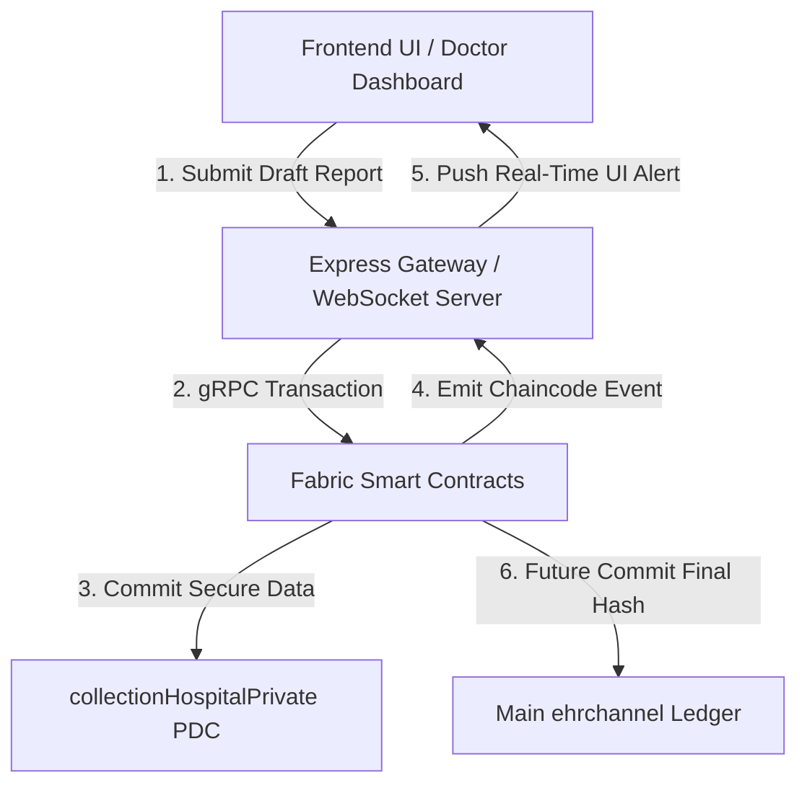

# HospitalOrg Blockchain EHR System: Technical Analysis & Audit Report

> **Comprehensive Academic and Technical Audit**
> *In-depth analysis of the ehr-chaincode-v3, ehr-backend-v3, and ehr-frontend-v2 architectures.*

---

## 1. Existed Architecture

### Folder & Module Mapping
The HospitalOrg module serves as the primary medical administration node in the federated EHR system.
*   **ehr-chaincode-v3/**: Contains the Hyperledger Fabric Node.js smart contracts (accessControl.js, ehrContract.js, visitContract.js, patientContract.js, claimsContract.js). This layer enforces business logic, role-based access, and anchors off-chain IPFS CIDs to the ledger.
*   **ehr-backend-v3/**: Houses the API Gateway microservices (peer0-api, peer1-api, peer2-api, patient-api, extorg-api). Built with Express.js, these nodes authenticate clients via JWT and proxy transactions to the Fabric network using the @hyperledger/fabric-gateway SDK.
*   **ehr-frontend-v2/**: A React 18 + Vite frontend providing role-specific UI dashboards (Admin, Doctor, Patient, Pharmacist) to interact with the backend APIs.
*   **ehr-network/**: Infrastructure automation scripts encompassing docker-compose.yaml, configtx.yaml, and crypto material configurations (crypto-config.yaml) to bootstrap the Fabric network.

### System Component Flow
1.  **Client Request:** A Doctor logs into the React frontend and requests to update a patient's EHR.
2.  **API Gateway Routing:** The request hits peer0-api (Express.js) via HTTP REST. The API verifies the clinician's JWT.
3.  **Off-Chain Anchoring:** The heavy clinical payload (JSON/PDF) is uploaded to an IPFS Kubo node (handled via an IPFS microservice), generating an immutable CID.
4.  **Smart Contract Invocation:** The API Gateway uses the fabric-gateway gRPC client to submit a transaction (e.g., UpdateEHRCID) using the clinician's Fabric X.509 certificate.
5.  **Access Control & Consensus:** The Fabric peer evaluates the ABAC rules in accessControl.js (verifying role=doctor and active consent). Upon endorsement, the orderer blocks the transaction and the CouchDB world state is updated.

---

## 2. What are your observations

### Current State of Implementation
*   **Fully Functional:** Fabric network topology orchestration (Orderers, Peers, CouchDB), Smart contract ABAC enforcement, JWT-to-Fabric identity binding, and off-chain CID anchoring.
*   **Partially Implemented:** The Frontend UI is mocked in certain state transitions. The integration between the React UI and the actual Fabric wallets relies on a coupled REST proxy.

### Code Quality & Pattern Evaluation
*   **Modularity:** Excellent separation of concerns in the chaincode (ehrContract.js vs accessControl.js).
*   **Error Handling:** The API gateways utilize express-validator and helmet, showing good baseline security hygiene. 
*   **Reentrancy & Concurrency:** Hyperledger Fabric's MVCC (Multi-Version Concurrency Control) mitigates smart contract reentrancy, but concurrent writes to the same EHR:patientId key currently risk MVCC read-write conflict rejections under high load.

### Security & Access Control Audit
*   **Identity & ABAC:** Robust implementation. accessControl.js correctly parses ctx.clientIdentity to extract X.509 attributes.
*   **Consent Model:** Dynamic, time-bound consent grants (GrantAccess / RevokeAccess) provide strong patient sovereignty.

---

## 3. Existed Limitations

> [!WARNING]
> **Scalability Bottlenecks**
> *   **MVCC Conflicts on High-Frequency Writes:** The cidHistory array in ehrContract.js appends every update to a single state key. High-frequency updates will cause severe Fabric MVCC conflicts.
> *   **IPFS Garbage Collection:** No mechanism exists to pin or unpin stale EHR CIDs, leading to infinite bloat on the off-chain storage layer.
> *   **Database & Query Optimization:** Missing explicit CouchDB index definitions (META-INF/statedb/couchdb/indexes/), which will cause slow rich queries and trigger performance warnings under heavy network load.

> [!CAUTION]
> **Privacy & Compliance Violations**
> *   **Ledger Metadata Leaks:** The reason and section fields in the UpdateEHRCID ledger audit trail are stored in plaintext. This metadata can indirectly leak patient diagnosis data to unauthorized ledger nodes.
> *   **Lack of Private Data Collections (PDC):** Lab results are currently committed to the shared channel ledger, meaning all organizations (Hospital, Provider, Diagnostics) can theoretically see internal/unapproved lab data before it is finalized.

> [!IMPORTANT]
> **Architectural Flaws & Incomplete Features**
> *   **Authentication Vulnerabilities:** JWT refresh tokens are entirely stateless with no blacklist or revocation mechanism implemented, leaving active sessions vulnerable if compromised.
> *   **Event-Driven Architecture Missing:** Zero implementation of Fabric Chaincode Events (stub.setEvent). The system relies on polling instead of real-time WebSocket notifications.
> *   **Network Centralization & Hardcoding:** Gateway .env configurations and peer addresses are strictly hardcoded for localhost.

---

## 4. What you have to enhance and overcome the drawbacks

### 1. Ledger Metadata Cipher (Resolves Metadata Leaks)
*   **Enhancement:** Apply SHA-256 hashing or symmetric encryption to audit trail strings (like reason) before committing to the public ledger.

### 2. Composite Key Architecture (Resolves MVCC Conflicts)
*   **Enhancement:** Refactor ehrContract.js to use Fabric Composite Keys instead of appending to an array. Store updates as EHR_UPDATE~patientId~timestamp to allow concurrent high-frequency writes without transaction rejections.

### 3. Fabric Private Data Collections (PDC) (Resolves Inter-Org Data Leaks)
*   **Enhancement:** Isolate sensitive data such as draft lab reports or internal hospital operational notes into a PDC (collectionHospitalPrivate). Only anchor the public cryptographic hash to the main ehrchannel until the visit is officially finalized.

### 4. Embedded JSON Indexing (Resolves Query Bottlenecks)
*   **Enhancement:** Define and package standard CouchDB JSON indexes inside the chaincode META-INF folder to optimize getStateByRange and eliminate full-state database scans.

### 5. Real-Time Chaincode Event Subscriptions (Resolves Polling Inefficiency)
*   **Enhancement:** Implement stub.setEvent in ForwardContract and LabContract. Establish a WebSocket or Server-Sent Events (SSE) server in the backend to push real-time notifications to the React frontend.

### 6. Stateful Token Revocation & Dynamic Environments
*   **Enhancement:** Implement a Redis cache for active JWT blacklisting to enforce secure session termination. Refactor configuration files to resolve hostnames dynamically for multi-host deployments.

---

## 5. Proposed architecture based on your novelty

### Novel Integration Layer: Privacy-Preserving Event-Driven State Channels
To solve the data visibility limitations while supercharging the UI experience, the proposed architecture introduces a dual-layer enhancement: **Fabric Private Data Collections (PDC)** integrated seamlessly with **Real-Time WebSockets**. 

1. Internal staff actions (like draft lab reports or internal doctor notes) are committed exclusively to a collectionHospitalPrivate PDC.
2. The transaction triggers an immediate stub.setEvent, which the Node.js API Gateway intercepts and broadcasts over an encrypted WebSocket to the React frontend.
3. The UI updates instantly for authorized staff, while external organizations (like Pharmacies or Insurance) see absolutely nothing until a final, public "Approve" transaction is made to the main ehrchannel.

### Novel System Architecture Diagram

---

## Hospital Module Master Audit & Implementation Matrix

### Master Technical Matrix

| Domain | Identified Limitation / Vulnerability | Proposed Fix / Novel Feature | Difficulty Level | Time Estimate | Feasibility Rating | Primary Impact & Value Add |
| --- | --- | --- | --- | --- | --- | --- |
| **Privacy & Compliance** | Plaintext reason and section metadata stored on the public Fabric ledger. | **Metadata Hash/Cipher:** Apply SHA-256 hashing or symmetric encryption to audit trail strings before committing. | **Low** | 1-2 Days | 5.0/5.0 | Stops ledger nodes from inferring patient diagnosis via metadata inspection. |
| **Privacy & Compliance** | All organizations see unapproved or draft lab reports on the shared channel. | **Fabric Private Data Collections (PDC):** Route unfinalized clinical data through collectionHospitalPrivate. | **Medium** | 3-5 Days | 5.0/5.0 | Isolates sensitive internal drafts until explicit public finalizing transaction. |
| **Performance & Scale** | MVCC write conflicts when appending updates to a single cidHistory array. | **Composite Key Architecture:** Refactor chaincode to write updates under EHR_UPDATE~patientId~txId. | **Medium** | 3-5 Days | 5.0/5.0 | Enables concurrent high-frequency writes without transaction rejections. |
| **Performance & Scale** | Slow CouchDB rich queries (GetPatientsByStatus) under network load. | **Embedded JSON Indexing:** Package pre-defined indexes in chaincode META-INF/statedb/couchdb/indexes/. | **Low** | 1-2 Days | 5.0/5.0 | Eliminates full-state scans and drastically cuts query latency. |
| **Performance & Scale** | Infinite storage bloat due to missing off-chain IPFS garbage collection. | **IPFS Lifecycle Manager:** Node.js background worker to unpin unreferenced/stale CIDs. | **Low-Medium** | 2-3 Days | 4.0/5.0 | Prevents storage exhaustion on off-chain storage nodes. |
| **Security & Auth** | Stateless JWT refresh tokens lack blacklisting or revocation controls. | **Redis Session Revocation:** Stateful Redis store for active JWT invalidation and logout enforcement. | **Low-Medium** | 2-3 Days | 5.0/5.0 | Fixes session hijack vulnerabilities and enforces instant access termination. |
| **User Experience** | Dashboard requires manual page refreshes to view new chaincode updates. | **Real-Time Chaincode Events:** Implement stub.setEvent paired with WebSocket / SSE push channels. | **Medium** | 3-4 Days | 5.0/5.0 | Delivers instant UI updates when visits, records, or access grants change. |
| **Infrastructure** | Gateway config files hardcode localhost endpoints, preventing multi-VM setups. | **Dynamic Environment Resolution:** Refactor configs to read Tailscale/DNS hostnames dynamically. | **Low** | 1-2 Days | 5.0/5.0 | Enables true multi-host deployment across separate VMs or physical machines. |

### Implementation Recommendations

#### 1. Quick Wins (Sprint 1: Week 1)
* **Package CouchDB Indexes:** High ROI for minimal effort. Fixes database warnings immediately.
* **Encrypt Audit Metadata:** Fast fix in the chaincode layer to protect diagnosis privacy.
* **Redis JWT Revocation & Environment Configs:** Secures backend authentication and enables clean multi-VM deployment.

#### 2. Core Chaincode Optimization (Sprint 2: Week 2)
* **Composite Keys:** Eliminates Fabric's MVCC write limitations.
* **Private Data Collections (PDCs) & Events:** Implements channel privacy for unapproved drafts and lays the groundwork for real-time WebSocket alerts on the UI.
